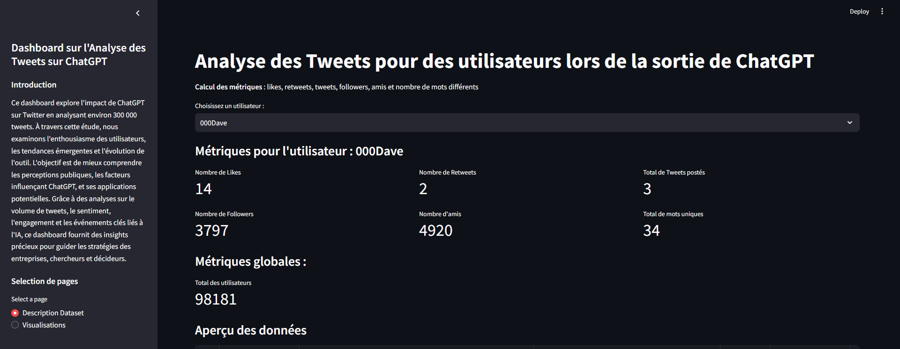
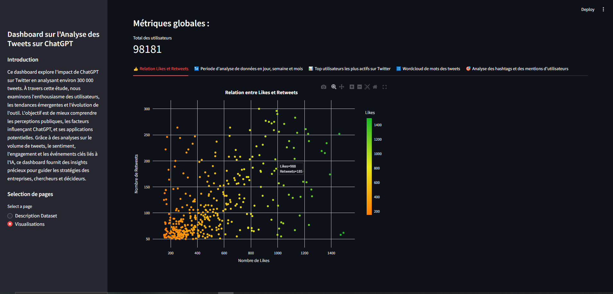

# Visualisation Dataviz sur Streamlit 

Ce dashboard explore l'impact de ChatGPT sur Twitter en analysant environ 300 000 tweets. À travers cette étude, nous examinons l'enthousiasme des utilisateurs, les tendances émergentes et l'évolution de l'outil. L'objectif est de mieux comprendre les perceptions publiques, les facteurs influençant ChatGPT, et ses applications potentielles. Grâce à des analyses sur le volume de tweets, le sentiment, l'engagement et les événements clés liés à l'IA, ce dashboard fournit des insights précieux pour guider les stratégies des entreprises, chercheurs et décideurs.

## Extraits d'images du Dashboard



## Installations à faire 
- Version Python 3.11.7
Importer le lien du projet et puis créez votre environnement virtuel
Importer le lien du projet et puis créez votre environnement virtuel
```
git clone https://github.com/vincent-tran-94/Dataviz_Streamlit.git
python3 -m venv env
source env/Scripts/activate
```
Diriger-vous vers le dossier
```
cd Projet_Streamlit/
```
Installer les dépendances 
```
pip install -r requirements.txt
```

## Analyse des données et import des fichiers CSV
Le fichier Projet_Vincent_Python.ipynb est un fichier notebook qui permet d'analyser les données sur les performances du rameur 
Vous devez impérativement installer Python sur votre machine ainsi que les dépendances 

*Select Kernel <Nom de l'environnement virtuel>*

## Lanchement de l'application web sur Streamlit
Lancer l'application Streamlit
```
streamlit run app.py
```
## Articles sur les Tweets 

- Effortlessly Scraping Massive Twitter Data with snscrape: A Guide to Scraping 1000,000 Tweets in Less than a Day
*https://medium.com/@ka2612/effortlessly-scraping-massive-twitter-data-with-snscrape-a-guide-to-scraping-1000-000-tweets-in-d01c38e82d18*  

- Cracking the ChatGPT Code: A Deep Dive into 500,000 Tweets using Advanced NLP Techniques
*https://medium.com/@ka2612/the-chatgpt-phenomenon-unraveling-insights-from-500-000-tweets-using-nlp-8ec0ad8ffd37*   

